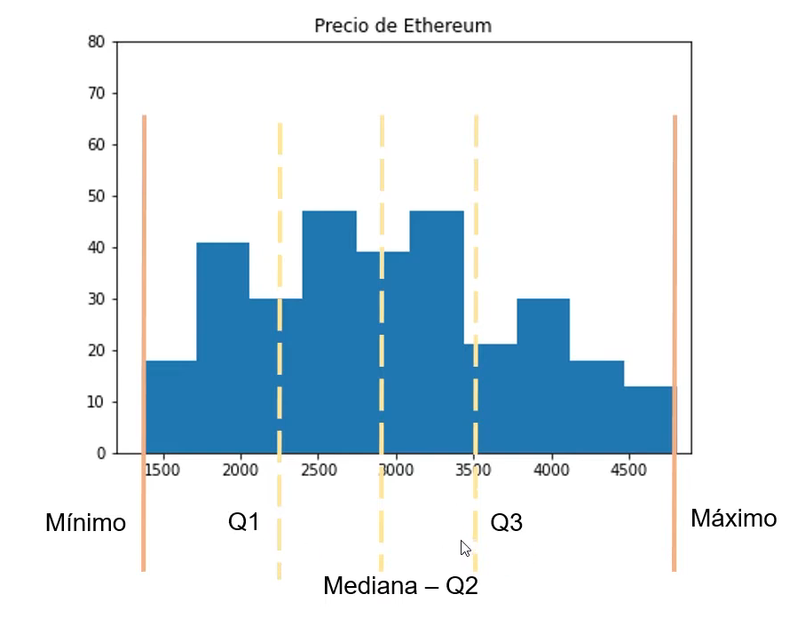

## Datos
Que son los datos?

- Es el petroleo del siglo XXI, son la materia prima con la que trabajan los estadisticos. 
- Vienen de diversas fuentes, imagen, video, texto, voz, numericos.

## Datos cuantitativos y cualitativos
### Datos cuantitativos : 
  - Son datos que pueden ser medidos o contados. Ejemplo: edad, peso, altura, temperatura, cantidad de dinero. 
  - Cuantificables
  - Datos numericos 
  - Objetivos

### Datos cualitativos: 
  - Son datos que no pueden ser medidos o contados. Ejemplo: color, forma, sexo, tipo de animal.
  - Cualidad
  - Palabras
  - Requieren transfomacion para ser tratados.

## Datos cuantitativos continuos y discretos
### Continuos
- Son datos que pueden tomar cualquier valor en un rango continuo. Ejemplo: altura, peso, temperatura.
- Se pueden medir con una precisión infinita.
- Se pueden representar con una curva de densidad.
- Son los que se pueden seguir subdividiendo continuamente.

### Discretos
- Son datos que pueden tomar solo un valor en un rango finito. Ejemplo: edad, cantidad de hijos, número de personas en una sala.
- Se pueden medir con una precisión finita.
- Se pueden representar con una tabla de frecuencias.
- Son los que no se pueden seguir subdividiendo continuamente.
- Es decir solo pueden un tipo de numero en un rango especifico. Ejemplo puedes tener un numero de hijos entre 0 y 5, pero no puedes tener 2.5 hijos.

## Datos cualitativos nominales vs ordinales

### Ordinales
- Suguen un orden o ranking (Me encanta, Medio, No me gusta).
- Son datos cualitativos que tienen un orden o ranking. Ejemplo: calificaciones (A, B, C, D, F), niveles de satisfacción (1, 2, 3, 4, 5), rango de edad (joven, adulto, anciano).
- Se pueden comparar y ordenar.
- Se pueden representar con números.

### Nominales
- Nominales (siguen una clasificación sin orden, marcas de coches, seat, ford, mustang, suzuki)
- Son datos cualitativos que no tienen un orden o ranking. Ejemplo: color (rojo, verde, azul), sexo (masculino, femenino), tipo de animal (perro, gato, pájaro).
- No se pueden comparar ni ordenar.
- Se pueden representar con palabras.

## Datos estructurados y no estructurados

### Datos estructurados
Son los datos que se ordenan en un formato de tipo tabla, donde tenemos columnas y filas. Las columnas con los nombres de las variables y las filas con los  registros valores de cada variable, estos registros pueden ser cualitativos o cuantitativos. Estos datos estructurados van de la mano de sql, que es un lenguaje de consulta estructurado para bases de datos.

### Datos no estructurados / NoSQL
Son por ejemplo los de tipo clave valor, como un diccionario, donde cada registro tiene una clave y un valor, ejemplo un 
Ejemplo: {"nombre": "Juan", "edad": 30, "ciudad": "Madrid"}, un JSON, NO SIGUE UN FORMAMATO DE TIPO TABLA

Los datos de tipo grafo, son nodos y relaciones entre estos, tienen su tipo especial de base de datos, y la forma en que se relaciona.

Los geoespatiales, son datos que tienen una relacion espacial, como por ejemplo la latitud y longitud de una ciudad, o la ubicacion de un punto en un mapa.

## Estadistica descriptiva vs Inferencial

### La estadistica
Tenemos un conjunto de datos y nos pregunta que significan los datos, es decir, que nos dice la informacion que nos dan. Que se puede hacer con estos datos?, de aqui surge el estudio de los datos, la estadistica. Tenemos dos tipos de estadistica: descriptiva y inferencial.

Definicion formal de estadistica: La practica o ciencia de recolectar y analizar datos numericos (datos cuantitativos), especialmente con el propocito de inferir en un todo a partir de aquellas en una muestra.

### La estadistica descriptiva:
Partir de los datos y ser capaces de describirlos, entenderlos, comprenderlos mejor, apartir de ahi sacar una conclusion  o informacion sobre estos datos que tenemos.

### La estadistica inferencial:
Ya no solo describimos, que incluso somos capaces de hacer inferencias o predicciones a futuro, gracias a los datos estudiamos lo que ha pasado a nivel historico o en eventos anteriores, apartir de la estadistica inferencial, podemos inferir o predicir datos, a partir de datos historicos.

## Medidas estadisticas.

Digamos que quiero estimar cuanto es la duracion media que realizara cada alumno en terminar el curso.
### Medidas de tendencia central y dispersion.

Tenemos un conjunto de datos el cual vamos extraer informacion que nos permite entender mejor a estos estudiantes.

### Medidas de tendencia central 
Son medidas que nos permiten entender mejor la centralidad de los datos, es decir, que valor se repite mas veces en el conjunto de datos.
  - Media aritmetica: es la suma de todos los valores dividido por la cantidad de valores.
  - Mediana: es el valor que se encuentra en la mitad del conjunto de datos, cuando estos estan ordenados.
  - Moda: es el valor que se repite mas veces en el conjunto de datos.

### Medidas de dispersion
Son medidas que nos permiten entender mejor la dispersion de los datos, es decir, que valores se alejan de la centralidad.
  - Rango: es la diferencia entre el valor maximo y el minimo.
  - Desviacion estandar: es una medida de la dispersion de los datos, es decir, que valores se alejan de la media.
  - Varianza: es la media de las cuadrados de las diferencias entre cada valor y la media.

### Medidas de asimetria
Son medidas que nos permiten entender mejor la asimetria de los datos, es decir, que valores se alejan de la centralidad.
  - Simetria: si la media, mediana y moda son iguales, los datos son simetricos.
  - Asimetria positiva: si la media es mayor que la mediana, los datos son asimetricos positivos.
  - Asimetria negativa: si la media es menor que la mediana, los datos son asimetricos negativos.

### Medidas de dependencia
Son medidas que nos permiten entender mejor la relacion entre dos variables, es decir, que valores se alejan de la centralidad.
  - Correlacion: es una medida de la relacion lineal entre dos variables, es decir, que valores se alejan de la centralidad.
  - Regresion: es una medida de la relacion lineal entre dos variables, es decir, que valores se alejan de la centralidad.

## Población vs Muestra

### Definición del problema estadístico
Queremos realizar un análisis estadístico que nos permita predecir las notas de cada uno de los alumnos basándonos en variables como las horas de estudio, la asistencia a clases, la edad, entre otros factores. Para realizar este análisis, debemos partir de un conjunto de datos.

### ¿Qué es la población?
La primera tarea sería recolectar datos de todos los alumnos de la escuela. Este conjunto completo se conoce como **población**: la cantidad total de individuos que forman parte del estudio. Sin embargo, esto sería muy complejo y costoso, ya que implicaría preguntarle a cada uno de los alumnos de la universidad.

### ¿Por qué usar una muestra?
A nivel estadístico no es necesario encuestar a toda la población. Es suficiente con obtener una **muestra** representativa que nos permita hacer inferencias sobre el conjunto completo.

### Características de una muestra adecuada
Si vamos a la universidad y le preguntamos solo a 10 alumnos, ¿esta muestra sería suficiente para realizar el análisis estadístico? La respuesta es no, por dos motivos principales:

1. **Representatividad**: La muestra debe ser representativa del conjunto de la población. Si no incluimos estudiantes de modalidad remota o de intercambio, estos grupos no podrán ser representados en la muestra ni en la teoría resultante.

2. **Aleatoriedad**: Cada alumno de la universidad debe tener la misma probabilidad de ser seleccionado para formar parte de la muestra.

### Tamaño muestral adecuado
Diez alumnos son muy pocos si lo que queremos es inferir o extrapolar los resultados a todos los alumnos de la universidad. Se deben definir técnicas estadísticas que nos permitan determinar el tamaño muestral adecuado para realizar un análisis estadístico confiable.

### Metodología de muestreo recomendada
Una estrategia efectiva sería solicitar a la universidad un listado completo de los alumnos y sus correos electrónicos. Posteriormente, seleccionar de forma aleatoria una muestra que cumpla con el tamaño muestral adecuado y enviarles una encuesta por correo electrónico. De esta manera, obtendremos una muestra suficientemente representativa y con un tamaño muestral apropiado para inferir o extrapolar los resultados a todos los alumnos de la universidad.

## Medidas de tendencia central 
El siguente dataset es el conjunto de beneficios  que obtenido cada mes de mis inverciones.

Si me preguntan cuanto espero ganar el siguiente mes, lo comun es decir la media aritmetica.

### La media
Es el sumatorio de todos los elementos y dividirlo entre la cantidad de elementos.

Seria 183.89, solo un mes hemos obtenido un valor mayor 120, y eso distorciona los datos.

### La mediana 
Ordenamos los valores de menor a mayor y el valor central una vez que los hemos ordenado seria la mediana, como son elementos impares esta facil es valor de en medio, pero si no fuera asi tomamos los dos valores centrales los sumamos y dividimos entre dos y nos daria la mediana.

### La moda seria el valor que se repite mas veces

## Medidas de dispersion

Las medidas de dispersion nos permiten entender mejor la dispersion de los datos, es decir, que valores se alejan de la centralidad.

En al asiguiente imagen muestra un histograma de los datos de los precios de ethereum vs amazon, donde vemos la dispercion de estos de su centralidad, con amazon mostrando una centralidad mayor que ethereum, donde ethereum tiene una mayor dispersion.

## Histograma
Un histograma es una representación gráfica de la distribución de frecuencia de un conjunto de datos. Se divide en intervalos o "bins" y cada barra representa la cantidad de observaciones que caen en ese intervalo.
- Tenemos un conjunto de datos:
3005, 3009, 3006, 3007, 3004, 3001, 3004, 3008, 3002

- Si queremos desarollar el histograma es ordenar los datos de menor a mayor.
3001, 3002, 3004, 3004, 3005, 3006, 3007, 3008, 3009

- Definir el numero de rectangulos o figuras a tener seran en nuestro caso 5 cubos:

3000-3002  3002-3004  3004-3006 3006-3008 3008-3010

- Despues contamos la frecuencia que ocurren cada uno de los datos en el intervalo y asi obtendremos la altura de cada rectangulo.

3000-3002  tenemos 1
3002-3004  tenemos 1
3004-3006  tenemos 3
3006-3008  tenemos 2
3008-3010  tenemos 2

La tabla de frecuencia se arma con la primer columna los intervalos, la segunda columna se colocan las frecuencias.

Despues armamos el histograma con los intervalos y las frecuencias.

## Histograma vs grafica de barras
Con frecuencia los histogramas y los graficos de barra se confunden, un histograma maneja datos cuantitativos, mientras que un grafico de barra maneja datos cualitativos. Las barras de histograma estan unidas (continuidad) mientras que las barras de grafico de barra no estan unidas (discontinuidad).

## El resumen de los 5 números
Este esta compuesto por cinco numeros:
- Máximo Q4
- Tercer Cuartil (Q3)
- Mediana Segundo Cuartil (Q2)
- Primer Cuartil (Q1)
- Mínimo Q0

Supongamos tenemos los siguientes numeros:

110, 105, 100, 840, 95, 100, 120

Los ordenamos de menor a mayor:

95, 100, 100, 105, 110, 120, 840

Despues tenemos que identificar el valor mínimo y el valor máximo.

Mínimo-------------------- Máximo
**95**, 100, 100, 105, 110, 120, **840**

- Mínimo Q0 = 95
- Máximo Q4 = 840

Luego el elemento central es el Q2, que es la mediana.
- Mediana Q2 = 105

-------------Mediana
95, 100, 100, **105**, 110, 120, 840

Para calcular el primer cuartil (Q1) y el tercer cuartil (Q3), necesitamos dividir los datos en dos mitades iguales. En este caso, la mediana es 105, por lo que la mitad de los datos es menor que 105 y la otra mitad es mayor.

- Primer Cuartil (Q1) = 100

- Tercer Cuartil (Q3) = 120

El resumen de 5 números de nuestro conjunto de datos sería:
- Mínimo Q0 = 95
- Primer Cuartil (Q1) = 100
- Mediana Q2 = 105
- Tercer Cuartil (Q3) = 120
- Máximo Q4 = 840

### ¿Qué pasa cuando el conjunto de números es par?
95, 100, 100, 105, 110, 120, 125, 840

- El máximo es 840 y el mínimo es 95.

- Sabemos que si es par la mediana se compone por los dos valores centrales y se promedian.
- Mediana Q2 = (105 + 110) / 2 = 107.5
- Para el cuartil uno dividimos el conjunto de datos en dos mitades iguales.

- El primer cuartil (Q1) es el valor que separa el 25% de los datos más bajos de los restantes 75%.

Para calcular el Q1, tomamos los valores medios de la primer mitad de los datos. Los umamos y dividimos entre dos.

- 100 + 100 = 200
- Q1 = 200 / 2 = 100
- En este caso, el primer cuartil es 100.

Para calcular el Q3, tomamos los valores medios de la segunda mitad de los datos. Los sumamos y dividimos entre dos.

- 120 + 125 = 245
- Q3 = 245 / 2 = 122.5
- En este caso, el tercer cuartil es 122.5.

El resumen de 5 números de nuestro conjunto de datos sería:
- Mínimo Q0 = 95
- Primer Cuartil (Q1) = 100
- Mediana Q2 = 107.5
- Tercer Cuartil (Q3) = 122.5
- Máximo Q4 = 840

### Rango y rango intercuartil
- Rango = Máximo - Mínimo
- Rango Intercuartil = Tercer Cuartil (Q3) - Primer Cuartil (Q1)

Retomando los valores de nuestro conjunto de datos primero:
- Mínimo Q0 = 95
- Primer Cuartil (Q1) = 100
- Mediana Q2 = 105
- Tercer Cuartil (Q3) = 120
- Máximo Q4 = 840

El rango seria  
Rango = Máximo Q4 - Mínimo Q0 = 840 - 95 = 745
Rango Intercuartil = Tercer Cuartil (Q3) - Primer Cuartil (Q1) = 120 - 100 = 20

## Diagrama de caja 
Para realizarlo necesitamos los siguientes elementos:
- El rango intercuartil (Q3 - Q1)
- El primer cuartil (Q1)
- La mediana (Q2)
- El tercer cuartil (Q3)
- El máximo (Q4)
- El mínimo (Q0)

Primero dibujamos el histograma con los intervalos y las frecuencias.

Sobre este histograma vamos a añadir el resume de los 5 números.

El diagrama de caja esta compuesto por una caja que va de Q1 a Q3, y una linea vertical que pasa por la mediana. Los brazos o bigotes son lineas que se extienden desde la caja hasta los valores más bajos y más altos que no son considerados outliers. El primer bigote va de Q1 a Q0, y el segundo bigote va de Q3 a Q4.

El diagrama de caja y bigotes nos permite poder observar la dispersón de los datos y la centralidad de los mismos.

## ¿Que son los valores atipicos?
Los outliers o valores atípicos son puntos individuales en un conjunto de datos que se desvían significativamente de la mayoría de los demás puntos. Estos valores atípicos pueden ser resultado de errores de medición, experimentos erróneos o simplemente representan una situación única en el conjunto de datos.

En el histograma siguiente tenemos, un valor que se separa de la frecuencia de nuestros demas valores, el valor esta mu separado de los demas

Para poder identificarlo, de forma visual, se dibuja un bigote desde el valor atípico hasta la caja. Si el bigote se extiende más allá de la caja, se considera un valor atípico. Este valor atipico se le pone un punto para representarlo.

Como se calcula tenemos los datos y obtenemos el resumen de 5 numeros.

Calculamos el rango intercuartil.
Rango Intercuartil = Tercer Cuartil (Q3) - Primer Cuartil (Q1) = 120 - 100 = 20

Calculamos el limite inferior y el limite superior.

Valor atípico leves
- Limite Inferior  = Primer Cuartil (Q1) - 1.5 * Rango Intercuartil = 100 - 1.5 * 20 = 70
- Limite Superior  = Tercer Cuartil (Q3) + 1.5 * Rango Intercuartil = 120 + 1.5 * 20 = 150

Esto quiere decir que cualquier valor menor que 70 o mayor que 150 se consideran valores atípicos.

Valores atípicos extremos
- Limite Inferior  = Primer Cuartil (Q1) - 3 * Rango Intercuartil = 100 - 3 * 20 = 40
- Limite Superior  = Tercer Cuartil (Q3) + 3 * Rango Intercuartil = 120 + 3 * 20 = 180

Esto quiere decir que cualquier valor menor que 40 o mayor que 180 se consideran valores atípicos extremos.
Entonces en el conjunto de datos solo tenemos un valor atípico que es 840. El caul aparte es atípico extremo.

## Medidas de dispersion
La desviacion estandar y la variaza.

Ejemplos si 4 amigos quedan deacuedo para ir a un restaurante, la distancias de cada uno al restaurante seria
amigo 1 : 1km
amigo 2 : 6km
amigo 3 : 4km
amigo 4 : 10km

La media de distancia seria = 5.25 km

Tenemos personas que estan muy cerca y otras muy lejos, lo que nos intereza es como de diferente se distribuye conforme a la media. Entonces vamos a calcular la diferenica de cada una de las distancias conforme a la media. 
Los amigos estan separados de la media de la siguiente forma
amigo 1 : 4.5km de la media
amigo 2 : 0.75km de la media
amigo 3 : 1.25km de la media
amigo 4 : 4.75km de la media 

Lo que vemos es que algunos estan viviendo muy cerca o muy lejos del restaurante por lo que no a todos les va importar igual.

### Ejemplo númerico
Datos: 6,9,6,3
Calculamos la media
Media = (6 + 9 + 6 + 3) / 4 = 6

Ver la diferencia de cada elementeo respecto a la media 

Sumamos todas la diferencias y lo dividimos entre n menos 1, debido a que se trabaja con una muestra y no la poblacion total.

Sino nos damos cuentas esto da como resultado 0 porque tenemos valores que se canselan, por lo que debemos usar una forma modificada que permita que los valores negativos o positivos se cancelen o anulen.

Entonces lo que haremos es elevar al cuadrado cada una de las diferencias y sumarlas para alfinar dividir entre el numero de elementos menos 1. A esto se le conoce como la varianza.

Una vez que hemos obtenido la varianza, la raiz cuadrada de esta nos da la desviación estandar.

La desviación estandar nos permite ver como de diferente se distribuyen los datos con respecto a la media. En este caso los datos se distribuyen en torno a la media de 6 con una desviación estandar de 2.236. Esto quiere decir que la mayoría de los datos se encuentran entre 4 y 8. La desviación es una medida de dispersión.

## Medidas de asimetria 

En la siguiente imagen tenemos tres histogramas, cada uno con una distrubucion diferente.
- El primero es una asimetria negativa, ya que la cola se encuentra a la izquierda de la media.
- El segundo es una asimetria positiva, ya que la cola se encuentra a la derecha de la media.
- El tercero es una asimetria simetrica, ya que la media y la mediana se encuentran en el mismo punto.

## Asimetria positiva
Una de las distribuciones símetricas mas comunes es la distribución normal, ya que la media, la mediana y la moda se encuentran en el mismo punto.
Un ejemplo de distribución normal es la altura de las personas, ya que la mayoría de las personas tienen una altura cercana a la media, con una desviación estandar de un cierto valor.

Otro ejemplo son las calificaciones de un examen, ya que la mayoría de las calificaciones se encuentran cerca de la media, con una desviación estandar de un cierto valor. Pocos con calificaciones muy altas o muy bajas.

## Asimetria negativa
La asimetria negativa se produce cuando la cola de la distribución se encuentra a la izquierda de la media. Donde la media es menor que la mediana. Un ejemplo puede ser la edad de muerte la es mayor en edades avanzadas y menor en edades más jóvenes.En un examen facil la mayoría de los alumnos obtienen una calificación alta, y pocos con calificaciones bajas.

## Asimetría positiva
La asimetría positiva se produce cuando la cola de la distribución se encuentra a la derecha de la media. Donde la media es mayor que la mediana. Por ejemplo el numero de mascotas  la mayoría de las personas tienen 0 o 1 mascotas, y pocos con más de 5 mascotas. Otro ejemplo es en examenes muy dificiles la mayoría de los alumnos obtienen una calificación baja, y pocos con calificaciones altas.

La simetria se puede analizar muy bien con diagramas de caja y bigotes. En la asimetria negativa el brazo izquierdo sera el brazo mas largo y el mas corto el derecho, en la asimetria positiva el brazo derecho sera el brazo mas largo y el mas corto el izquierdo. En la distribución simetrica el brazo izquierdo y derecho seran iguales.

## Conclusión 
Estadistica descriptiva:

### Medidas de tendencia central
- Media 
- Moda
- Mediana

### Medidas de dispersión
- Histograma
- Resumen de 5 números
- Diagrama de caja
- Varianza
- Desviación estandar

## Medidas de asimetría
- Asimetria negativa
- Simetrica
- Asimetria positiva