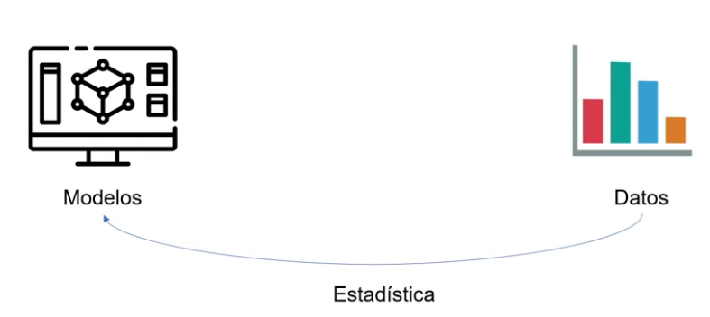

# Probabilidad vs estadistica
## Probabilidad
La probabilidad es la medida de la posible ocurrencia de un evento. Es un número entre 0 y 1, donde 0 significa que el evento no puede ocurrir, y 1 significa que el evento seguro ocurrirá.

## Estadistica
La estadistica es la ciencia que se encarga de recopilar, organizar, analizar y interpretar datos. Y parte de estos datos para crear modelos.

La estadistica parte de un conjunto de dato, con la estadistica descriptiva, se entienden estos datos, y apartir de los datos con la estadistica inferencial se desarrollan modelos a partir de estos datos historicso, infiere un nuevo valor a partir del los anteriores.

La probabilidad crea modelos logicos que permiten crear esos datos, hace uso del metodo inductivo, que intenta establecer patrones que permita determinar que es lo que va ocurrir, que datos obtendremos.

## La probabilidad
La probabilidad surgio de la nesecidad de predecir el resultado de un evento aleatorio, es decir para cubrir los juegos de azar. Poder predecir si podian ganar en un juego o valia la pena participar en el.

## Regla de laplace.
Existen diferentes tipos de experimetos, los experimentos deterministas y alateorios.

- Experimeto determinista: Siempre que mantengamos las mismas condiciones iniciales, simpre obtendremos el mismo resultado.

- Experimento aleatorio: Aunque mantengamos las mismas condiciones iniciales, obtendremos diferentes resultados siempre que realicemos el experimento.

- Espacio muestral: Es el conjunto de todos los posibles resultados de un experimento aleatorio. En el caso de lanzar una moneda tenemos dos posibles resultados, cara o cruz, estos dos valores son el espacio muestral {c, x} c - cara, x - cruz.

- Eventos o sucesos: Es el resultado de un experimento aleatorio. En el caso de lanzar una moneda, los posibles eventos son cara o cruz. Es un subconjunto del espacio muestral.

Probabildad de que caiga cara:
P(c) = evento / espacio muestral = 1 / 2 

La ley de los grandes numeros dice que a medida que realizamos mas experimentos, la probabilidad experimental mas se acercara a la probabilidad teorica(calculada).

### Ejemplo del dato:
- Lanzar un dado es en primera instancia un experimeto aleatorio, siempre que se lance un dado caera un numero de forma aleatoria entre 1 y 6.
- El espacio muestral de lanzar un dado es {1, 2, 3, 4, 5, 6}
- Probabilidad de que salga el uno P(1) = evento / espacio_muestral = 1 / 6 
- El evento de que salga un numero par es {2, 4, 6}
- La probabilidad de que salga un numero par es 3 / 6 = 1 / 2

## Evento complementario y moneda trucada

- Una moneda justa es una moneda que puede caer al lanzarse tanto cara como cruz con la misma probabilidad.
- Una moneda trucada es una moneda que puede caer una cara con una probabilidad mayor que la de cruz, o viceversa. Porque esa moneda tiene dos caras y nunca caera cruz.

Espacio muestral:
{ Cara, Cruz } en una moneda normal
{Cara, Cara } en una moneda trucada

La probabilidad siempre va a dar uno o como suma de probabilidades de los elementos en el espacio muestral, serían 1. 
En le caso de la mondeda trucada tenemos la probabilidad de que salga cara P(Cara) = 2 / 2 = 1  es decir tenemos el 100 % de probabilidad de que salga cara.

En el caso de P(X) = 0 / 2 = 0 es decir tenemos el 0 % de probabilidad de que salga cruz.

Pero que pasa si tenemos una moneda que tiene una probabilidad de 0.6 de caer cara y 0.4 de caer cruz.
- P(C) = 0.6 y P(x) = 0.4
- P(C) + P(X) = 1 = evento / espacio muestral
- P(x) = 1 - P(C) = 1 - 0.6 = 0.4

### Un evento complentario
Dos sucesos o eventos mutuamente excluyentes cuya unión es el espacio muestral.
