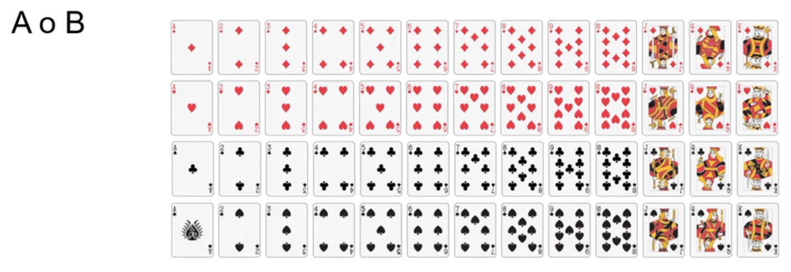

# Probabilidad vs estadistica
## Probabilidad
La probabilidad es la medida de la posible ocurrencia de un evento. Es un número entre 0 y 1, donde 0 significa que el evento no puede ocurrir, y 1 significa que el evento seguro ocurrirá.

## Estadistica
La estadistica es la ciencia que se encarga de recopilar, organizar, analizar y interpretar datos. Y parte de estos datos para crear modelos.

La estadistica parte de un conjunto de dato, con la estadistica descriptiva, se entienden estos datos, y apartir de los datos con la estadistica inferencial se desarrollan modelos a partir de estos datos historicso, infiere un nuevo valor a partir del los anteriores.

La probabilidad crea modelos logicos que permiten crear esos datos, hace uso del metodo inductivo, que intenta establecer patrones que permita determinar que es lo que va ocurrir, que datos obtendremos.

## La probabilidad
La probabilidad surgio de la nesecidad de predecir el resultado de un evento aleatorio, es decir para cubrir los juegos de azar. Poder predecir si podian ganar en un juego o valia la pena participar en el.

## Regla de laplace.
Existen diferentes tipos de experimetos, los experimentos deterministas y alateorios.

- Experimeto determinista: Siempre que mantengamos las mismas condiciones iniciales, simpre obtendremos el mismo resultado.

- Experimento aleatorio: Aunque mantengamos las mismas condiciones iniciales, obtendremos diferentes resultados siempre que realicemos el experimento.

- Espacio muestral: Es el conjunto de todos los posibles resultados de un experimento aleatorio. En el caso de lanzar una moneda tenemos dos posibles resultados, cara o cruz, estos dos valores son el espacio muestral {c, x} c - cara, x - cruz.

- Eventos o sucesos: Es el resultado de un experimento aleatorio. En el caso de lanzar una moneda, los posibles eventos son cara o cruz. Es un subconjunto del espacio muestral.

Probabildad de que caiga cara:
P(c) = evento / espacio muestral = 1 / 2 

La ley de los grandes numeros dice que a medida que realizamos mas experimentos, la probabilidad experimental mas se acercara a la probabilidad teorica(calculada).

### Ejemplo del dato:
- Lanzar un dado es en primera instancia un experimeto aleatorio, siempre que se lance un dado caera un numero de forma aleatoria entre 1 y 6.
- El espacio muestral de lanzar un dado es {1, 2, 3, 4, 5, 6}
- Probabilidad de que salga el uno P(1) = evento / espacio_muestral = 1 / 6 
- El evento de que salga un numero par es {2, 4, 6}
- La probabilidad de que salga un numero par es 3 / 6 = 1 / 2

## Evento complementario y moneda trucada

- Una moneda justa es una moneda que puede caer al lanzarse tanto cara como cruz con la misma probabilidad.
- Una moneda trucada es una moneda que puede caer una cara con una probabilidad mayor que la de cruz, o viceversa. Porque esa moneda tiene dos caras y nunca caera cruz.

Espacio muestral:
{ Cara, Cruz } en una moneda normal
{Cara, Cara } en una moneda trucada

La probabilidad siempre va a dar uno o como suma de probabilidades de los elementos en el espacio muestral, serían 1. 
En le caso de la mondeda trucada tenemos la probabilidad de que salga cara P(Cara) = 2 / 2 = 1  es decir tenemos el 100 % de probabilidad de que salga cara.

En el caso de P(X) = 0 / 2 = 0 es decir tenemos el 0 % de probabilidad de que salga cruz.

Pero que pasa si tenemos una moneda que tiene una probabilidad de 0.6 de caer cara y 0.4 de caer cruz.
- P(C) = 0.6 y P(x) = 0.4
- P(C) + P(X) = 1 = evento / espacio muestral
- P(x) = 1 - P(C) = 1 - 0.6 = 0.4

### Un evento complentario
Dos sucesos o eventos mutuamente excluyentes cuya unión es el espacio muestral.

## Lanzamiento consecutivo - A Y B
Obtener resultados de dos lanzamientos diferentes seguidos.
- Primer lanzamiento cara y segundo lanzamiento cruz
- Pimer lanzamiento cara y segundo lanzamiento cara
- Primer lanzamiento cruz y segundo lanzamiento cara
- Primer lanzamiento cruz y segundo lanzamiento cruz

El segunda lanzamiento de la moneda es un lanzamiento independiente, porque este no depende del primero.Por los que son lanzamientos independientes.

Calcular la probabilidad de caer cara en el primer lanzamiento, y cara en el segundo lanzamiento.
- P(Cara y  Cara) =   evento / espacio muestral =  1 / 4 = 0.25

Porque solo tenemos cuatro posibilidades cara y cara, cara y cruz, cruz y cara, cuz y cruz. El espacio muestral es de cuatro elementos y solo un evento puede dar cara y cara.

Otra forma de calcularlo es seguir el arbol de probabilidades, simpre vayamos de rama en rama es multiplicar por lo que seria 0.5 * 0.5 = 0.25 la probabildad de P(cara y cara ) = P(cara) * P(cara) = 0.5 * 0.5 = 0.25

Entonces cuando hablemos de probabilida de evento A y probabilidad del evento B se calcula
P(A y B) = P(A) * P(B), recordar que esto solo funciona cuando trabajamos con eventos independientes.
P(A ∩ B) es lo mismo que la prbobabilidad de A y probabilidad de B, seria probabilidad de A intersección pobabilidad B

### ejercicio dos calcular

P(al menos una cara) = evento / espacio_muestral 
- Tenemos 3 eventos donde puede darnos cara -> cara-cara, cara-cruz, cruz-cara, de un espacio muestral de cuatro solo faltaria donde nuca da cara cruz-cruz 
- P(al menos una cara) = 3 / 4 = 0.75
Para obtenerlo mediante el arbol de probabilidades, se suman los tres elementos:
P(al menos una cara) = P(cara-cara) + P(cara-cruz) + P(cruz-cara) = 0.25 + 0.25 + 0.25 = 0.75

Recordar que P(cara-cara), P(cara-cruz), P(cruz-cara) sus probabilidades se obtubieron de multiplicar las probabilidades en la rama del arbol de probabilidades.

P(solo una cara) = evento / espacio muestral = 2 / 4 = 0.5
Es esta por que la probabilidad(cara-cruz) = 0.25, la probabilidad (cruz-cara) = 0.25 se suman
P(solo una cara) = 0.25 + 0.25 = 0.5

Otra forma de representar el arbol es la tabla de probabilidades. 
Nota en el arbol de probabilidads, la suma de los nodos del mismo nivel es igual a 1. Y la multiplicacion de cada rama es igual a la probabilidad de ese evento consecutivo.

## Union de sucesos

La probabilidad del evento A o B.

Calcular la probabilidad de obtener un 8 o 10 de las 52 cartas de la baraja.
- Evento A: Obtener un 8
- Evento B: Obtener un 10
- Espacio muestral: 
{1, 2, 3, 4, 5, 6, 7, 8, 9, 10, J, Q, K} tréboles ( ♣ ) - NEGRAS, 
{1, 2, 3, 4, 5, 6, 7, 8, 9, 10, J, Q, K}  diamantes ( ♦ ) ROJAS, 
{1, 2, 3, 4, 5, 6, 7, 8, 9, 10, J, Q, K} corazones ( ♥ ) , ROJAS
{1, 2, 3, 4, 5, 6, 7, 8, 9, 10, J, Q, K} picas ( ♠ ) - NEGRAS

Esto es experimentos aleatorios
- P(10) = evento / espacio muestral = 4 / 52, donde tenemos 4 cartas con el numero 10 de 52 cartas.
- P(8) = evento / espacio muestral = 4 / 52, donde tenemos 4 cartas con el numero 8 de 52 cartas.
- P(8 O 10) = P(8 u 10) = 4 / 52 + 4 / 52 = 8 / 52 = 2 / 13
O lo que es lo mismo el número de casos favorables es 8 y el número de casos totales es 52.
- P(8 o 10) = 8 / 52 = 2 / 13
- P(A o B) = P(A) + P(B) 

### Siguiente ejemplo Probabilidad de 10 o de corazones

- P(10 U corazones) = P(10) + P(corazones) 
- P(10) evento / espacio_muestral = 4 / 52
- P(corazones) = evento / espacio_muestral = 13 / 52 = 0.25
- Pero tenemos un problema hay una carta que es el 10 de corazones, por lo que la probabilidad se debe ajustar restando la probabilidad de que salga el 10 de corazones P(10 y corazones) es lo que es lo mismo que  P(10 ∩ corazones) que es que ocurra el evento 10 y corazones al mismo tiempo.
- P(10 ∩ corazones) = evento / espacio_muestral = 1 / 52
- P(10 U corazones) = P(10) + P(corazones) - P(10 ∩ corazones) = 4 / 52 + 13 / 52 - 1 / 52 = 16 / 52  = 4 / 13

## Diagrama de Venn

Entender como se relacionan diferentes conjuntos entre si.

- El evento A.
- El evento B.
- Evento complementario C. Es uno menos la probabilidad de que ocurra el evento, para que sea un evento complementario debe ser mutuamente excluyente. Si ocurre el evento A, o ocurre el evento B, pero no ocurrir el evento C.
- A ∩  B  - A y B, es la probabilidad de que que ocurra el evento A y el evento B a la misma vez P(A ∩  B ) = P(A) * P(B).

- A U B es la probabilidad de que ocurra el evento A o el evento B, es la suma de las probabilidades de que ocurra el evento A y la probabilidad de que ocurra el evento B, menos la probabilidad de que ocurra el evento A y el evento B al mismo tiempo. P(A U B) = P(A) + P(B) - P(A ∩ B)

- Si los eventos son independientes, entonces P(A ∩ B) = 0 y la probabilidad de que ocurra A o B es la suma de las probabilidades de que ocurra A y la probabilidad de que ocurra B. P(A U B) = P(A) + P(B)

## Eventos dependientes 
Juego de la ruleta ´Visa´, se tienen cuatro personas {Mario, Juan, Fernando, Norma} y cada una saca su targeta de credito para pagar  el mesero eleigira de forma aleatoria y la targeta seleccionada sea la persona que tiene que pagar la comida de todos. Espacio muestral {M, J, F, N}

Cual seria la probabilidad de que le toque a Juan pagar la comida.

- P(Juan) = evento / espacio_muestral = 1 / 4 = 0.25

Como juan ya pago, en la segunda comida solo tendremos 3 personas {Mario, Fernando, Norma} para pagar el espacio muestral a cambiado. Espacio muestral {M, F, N}
- P(Mario) = evento / espacio_muestral = 1 / 3 = 0.33

Ahora como Mario ya pago la tercera comida, solo queda Norma y Fernando para pagar. Espacio muestral {F, N}
- P(Norma) = evento / espacio_muestral = 1 / 2 = 0.5

Entonces la probabilidad de que le toque pagar a Fernado esta condicionado a lo que aya ocurrido en eventos anteriores, por lo que estos son eventos dependientes, ya que la ocurrencia de cada evento cambia el espacio muestral.
A diferencia de lanzar una moneda, el espacio muestral es simpre el mismo y la ocurrencia de un evento no afecta al otro evento.

## Probabilidad condicionada 
Que dos eventos sean dependientes, quiere decir que el resultado del evento B, viene condicionado con lo que haya ocurrido en el evento A.

- Si tengo la baraja inglesa - Espacio muestral sería: 
{1, 2, 3, 4, 5, 6, 7, 8, 9, 10, J, Q, K} tréboles ( ♣ ) - NEGRAS, 
{1, 2, 3, 4, 5, 6, 7, 8, 9, 10, J, Q, K}  diamantes ( ♦ ) ROJAS, 
{1, 2, 3, 4, 5, 6, 7, 8, 9, 10, J, Q, K} corazones ( ♥ ) , ROJAS
{1, 2, 3, 4, 5, 6, 7, 8, 9, 10, J, Q, K} picas ( ♠ ) - NEGRAS

Cual entonces es la probabilidad de que me saque un 10 en la primera tirada:

Probabilidad de salga un dies en la primer tirada:
- P(10) = evento / espacio_muestral = 4 / 52 

Pero este juego tiene un truco que cada vez que se saca una carta esta se retira de la baraja, por lo que el espacio muestral se reduce en 1. En la siguiente tirada la probabilidad de que me saque un 10 en la segunda tirada , considerando que la carta que saque fue el un dies de rombos:

Probabilidad de que salga un dies en la segunda tirada, sabiendo que ha salido un dies de rombos en la primer tirada:
- P(10) = evento / espacio_muestral = 3 / 51

- Tenemos entonces que la probabilidad de A y B en eventos independientes es P(A) * P(B):
P(A ∩ B) = P(A) * P(B)
P(A ∩ B) = P(A) * P(B | A)

De aqui tenermos que la probabilidad de A dado que B ha ocurrido es:
P(B | A) = P(A ∩ B) / P(A)

Lo que nos daria algo parecido a la probabilidad de laplace:

P(B | A) = P(A ∩ B) / P(A) = evenoto / espacio_muestral

Ejemplo  la probabilidad de A y B:
P(A ∩ B) = P(A) * P(B | A) 
P(10 primera tirada | 10 segunda tirada) = P(10 primera tirada) * P(10 segunda tirada | 10 primera tirada)
P(10 primera tirada | 10 segunda tirada) = P(10 primera tirada) * P(10 segunda tirada | 10 primera tirada) = 0.0769 * 0.0588  = 0.00452172

Pero ahora queremos calcular la probabilidad de que salga un 10 en la primer tirada y en la segunda, salga un As.
- P(primera 10 ∩ segunda un As) = P(primera 10) * P(segunda un As | primera 10)
- P(primera 10) = 4 / 52
- P(segunda un As | primera 10) = 4 / 51 , Porque tengo cuatro as posibles como eventos, y restamos uno al espacio muestral porque la carta que saque fue el un dies de rombos.

- P(primera 10 ∩ segunda un As) = 4 / 52 * 4 / 51 = 0.0.00603 

### Probabilidad de B sabiendo que A
El juego es el siguiente, gano cuando saque una carta 10, pero el va y saca una carta y es roja, entonces me dice que que si sigo jugando, entonces cual es la probabilidad de que salga 10 sabiendo que ya salio una roja.
- P(B | A) = P(A ∩ B) / P(A) 
- P(10 | roja) = P(10 ∩ roja) / P(roja) 
- P(roja) = 26 / 52 = 0.5 esto es asi porque la mitad de las cartas son rojas
- P(10 ∩ roja) = 2  / 52 esto es asi porque solo hay dos cartas que sean 10 y rojas a la vez.
Entonces:
- P(10 | roja) = P(10 ∩ roja) / P(roja) =  (2  / 52 ) / 0.5 =  0.0077

