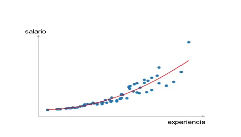

# Analista de datos con Python

## Estructura curso:

### Estadistica descriptiva
- Medidas de centralidad
- Medidas de dispersion
- Medidas de asimetria
- Visualizacion

### Probabilidad:
- Teorema de Lapalace
- Teorema de Bayes
- Distribucion Binomial
- Distribucion Normal
- Teorema Central del Limite

## Estadistica inferencial
- Contrastre de hipotesis
- Aprendizaje Automatico
- Regrecion Lineal
- Regrecion Logistica
- Matriz de confusion

